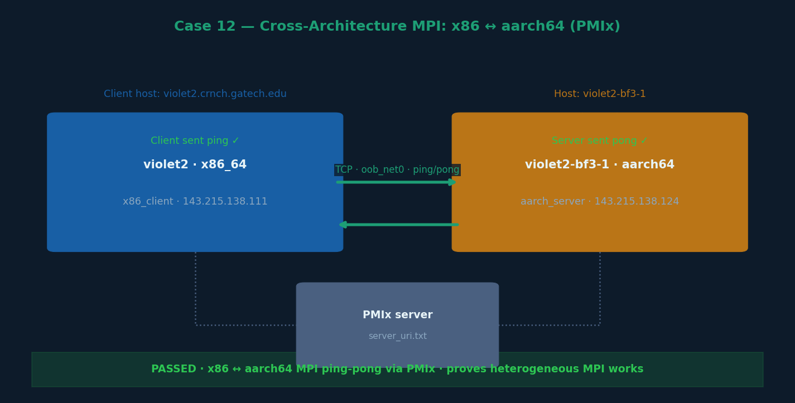

# Case 12 — MPI Cross-Architecture (x86 ↔ aarch64)



## What this case does

Demonstrates MPI communication between two processes running on different CPU
architectures: an x86_64 process on violet2 (host server) and an aarch64 process
on violet2-bf3-1 (BF3 ARM). This uses PMIx server-based process management
to connect independent processes across architectures.

## Hardware

| Node | Arch | Role | IP |
|---|---|---|---|
| violet2 | x86_64 | MPI client (x86_client) | 143.215.138.111 |
| violet2-bf3-1 | aarch64 | MPI server (aarch_server) | 143.215.138.124 |

## Steps

### Step 1 — Start PMIx server on violet2-bf3-1 (ARM)
```bash
(base) rn84@violet2-bf3-1:~/USERSCRATCH/bf3_code$ ompi-server \
    --no-daemonize \
    --report-uri server_uri.txt \
    --mca oob_tcp_if_include oob_net0 \
    --mca btl_tcp_if_include oob_net0
```

### Step 2 — Start aarch64 server process on violet2-bf3-1
```bash
(base) rn84@violet2-bf3-1:~/USERSCRATCH/bf3_code$ mpirun -np 1 ./aarch_server \
    --mca pml ob1 \
    --mca btl tcp,self \
    --mca oob_tcp_if_include oob_net0 \
    --mca btl_tcp_if_include oob_net0 \
    --mca pmix_server_uri file:/nethome/rn84/USERSCRATCH/bf3_code/server_uri.txt
```

Server output:
```
=== SERVER READY ===
Host: violet2-bf3-1
Arch: aarch64
PORT:
4080467969.0:4050273926
```

### Step 3 — Run x86 client on violet2 using the server's port URI
```bash
[rn84@violet2 bf3_code]$ mpirun -np 1 ./x86_client "4080467969.0:4050273926" \
    --mca pml ob1 \
    --mca btl tcp,self \
    --mca oob_tcp_if_include 143.215.138.0/25 \
    --mca btl_tcp_if_include 143.215.138.0/25 \
    --mca pmix_server_uri file:/nethome/rn84/USERSCRATCH/bf3_code/server_uri.txt
```

Client output:
```
Client host: violet2.crnch.gatech.edu
Arch: x86_64
Client sent ping
Client received pong
```

Server output (on completion):
```
Server received ping
Server sent pong
```

## Key observations

- PMIx-based connection bypasses the need for a shared hostfile
- Uses OOB management network (oob_net0 / 143.215.138.x) for TCP transport
- Proves x86 ↔ aarch64 MPI point-to-point works correctly
- This pattern enables heterogeneous workloads where GPU (x86) and SmartNIC (ARM)
  ranks communicate via MPI without sharing the same architecture

## Architecture diagram

```
violet2 (x86_64)              violet2-bf3-1 (aarch64)
  x86_client                     aarch_server
  MPI rank 0       ←─TCP─→      MPI rank 0
  143.215.138.111               143.215.138.124
```

## Use case

This technique can be extended to orchestrate GPU computation on the x86 host
alongside Vortex SIMX computation on the BF3 ARM, with MPI as the coordination
layer — a key building block for the full heterogeneous pipeline (Case 14).
