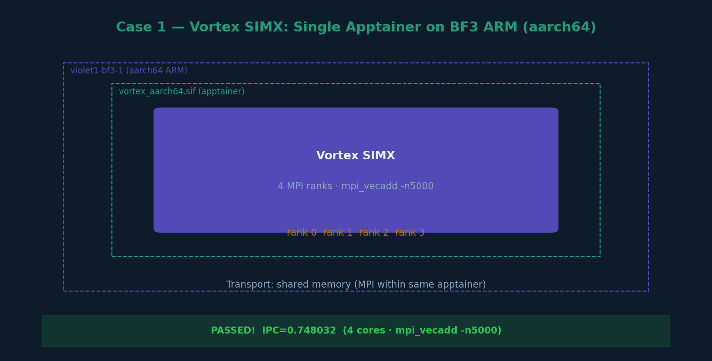

# Case 1 — Vortex SIMX on a Single Apptainer (BF3 aarch64)



## What this case does

Runs Vortex SIMX inside a single Apptainer container on the BF3 ARM processor (aarch64).
This is the foundational case — it proves that the Vortex RISC-V simulator (SIMX) compiles
and executes correctly on the BlueField-3 ARM architecture, which is a prerequisite for
all subsequent MPI and network cases.

## Hardware

| Node | Role | Arch | Key details |
|---|---|---|---|
| violet1-bf3-1 | BF3 DPU ARM | aarch64 | Ubuntu 22.04, 8 ARM cores |

## Setup

### Apptainer image
```
/nethome/rn84/USERSCRATCH/may_code/vortex/miscs/apptainer/vortex_aarch64.sif
```

This image is built from `miscs/apptainer/vortex_aarch64.def` (commit cc2aca7).
It contains: Ubuntu 22.04, OpenMPI, CMake 3.26, and build tooling for aarch64.
CUDA is intentionally excluded since BF3 ARM has no GPU.

### Toolchain (mounted at /home/tools inside container)
```
/nethome/rn84/USERSCRATCH/aarch_vortex_tools/
├── llvm-vortex/           # clang-18 aarch64 cross-compiler
├── riscstar-toolchain-15.2-r1-aarch64-riscv32-none-elf/  # RISC-V toolchain
├── libc32/                # bare-metal libc for riscv32
└── libcrt32/              # bare-metal compiler-rt for riscv32
```

### Vortex build (mounted at /home/vortex inside container)
```
/nethome/rn84/USERSCRATCH/may_code/vortex/build/
```

## Steps

### Step 1 — Enter the apptainer
```bash
cd ~/USERSCRATCH/may_code/vortex/build
apptainer shell --fakeroot --cleanenv --writable-tmpfs \
    --bind ~/USERSCRATCH/aarch_vortex_tools:/home/tools \
    --bind ~/USERSCRATCH/may_code/vortex:/home/vortex \
    ../miscs/apptainer/vortex_aarch64.sif
```

Or use the provided script:
```bash
cd ~/USERSCRATCH/may_code/vortex/miscs/apptainer
./run_apptainer.sh
```

### Step 2 — Build SIMX runtime (inside apptainer)
```bash
Apptainer> cd /home/vortex/build
Apptainer> CONFIGS="-DNUM_CORES=4" make -C ./ci/../runtime/simx -j
```

### Step 3 — Run a test using blackbox.sh
```bash
Apptainer> ./ci/blackbox.sh --cores=4 --app=mpi_vecadd --driver=simx --np=4 --args="-n5000"
```

Or run manually:
```bash
Apptainer> cd /home/vortex/build/tests/regression/mpi_vecadd
Apptainer> export VORTEX_DRIVER=simx
Apptainer> export LD_LIBRARY_PATH=/home/vortex/build/runtime:/opt/boost-1.66/lib:/opt/openssl-1.1/lib:$LD_LIBRARY_PATH
Apptainer> mpirun --allow-run-as-root --oversubscribe -np 4 ./mpi_vecadd -n5000
```

## Example output

```
CONFIGS=-DNUM_CORES=4
Running: CONFIGS="-DNUM_CORES=4" make -C ./ci/../runtime/simx > /dev/null
Running: OPTS="-n5000" MPI=1 NP=4 make -C "./ci/../tests/regression/mpi_vecadd" run-simx
rank = 1, world_size = 4
rank = 0, world_size = 4
rank = 2, world_size = 4
rank = 3, world_size = 4
Rank: 2- Upload kernel binary
Rank: 3- Upload kernel binary
Rank: 1- Upload kernel binary
Rank: 0- Upload kernel binary
PASSED!
PERF: core0: instrs=13045, cycles=69516, IPC=0.187655
PERF: core1: instrs=13045, cycles=69450, IPC=0.187833
PERF: core2: instrs=12997, cycles=67841, IPC=0.191580
PERF: core3: instrs=12997, cycles=69628, IPC=0.186663
PERF: instrs=52084, cycles=69628, IPC=0.748032
```

## Key observations

- System: `Linux violet1-bf3-1 6.8.0-1013-bluefield-64k aarch64`
- Container OS: Ubuntu 22.04.5 LTS (Jammy Jellyfish)
- SIMX runs all 4 MPI ranks on the single BF3 host, each with its own Vortex instance
- IPC ~0.748 with 4 cores configured
- The `--allow-run-as-root --oversubscribe` flags are required inside apptainer
- Transport: shared memory (MPI within same node)

## Key fix (commit cc2aca7)

The original `vortex.def` did not compile on aarch64. The fix involved:
- Splitting `vortex.def` → `vortex_aarch64.def` + `vortex_x86.def`
- Setting `RISCV_TOOLCHAIN_PATH` to the riscstar aarch64-hosted toolchain
- Adding `--target=riscv32-none-elf` to kernel compile flags
- Removing `nvidia-cuda-toolkit` from the aarch64 container definition
