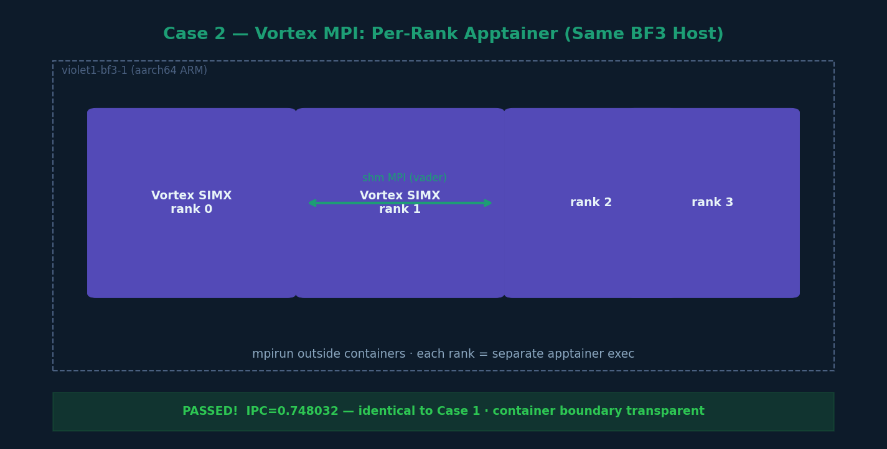

# Case 2 — Vortex MPI Between Two Apptainer Instances (Same BF3 Host)



## What this case does

Runs two MPI ranks of Vortex SIMX where each rank runs inside its own separate Apptainer
container on the same BF3 ARM host. This tests MPI communication between apptainer
instances sharing the same physical machine — using shared memory transport (CMA).

## Hardware

| Node | Role | Arch |
|---|---|---|
| violet1-bf3-1 | BF3 DPU ARM (single host) | aarch64 |

## Key distinction from Case 1

In Case 1, all ranks run inside a single apptainer invocation (MPI launched inside container).
In this case, `mpirun` is launched **outside** the container and each rank gets its own
separate apptainer exec invocation. This simulates independent container isolation per rank.

## Steps

### Step 1 — Set environment
```bash
# On violet1-bf3-1 (native, outside apptainer)
export VORTEX_DRIVER=simx
export LD_LIBRARY_PATH=/nethome/rn84/USERSCRATCH/may_code/vortex/build/runtime:\
/nethome/rn84/USERSCRATCH/may_code/vortex/third_party/ramulator:$LD_LIBRARY_PATH
```

### Step 2 — Run mpirun with per-rank apptainer exec
```bash
cd ~/USERSCRATCH/may_code/vortex/build

mpirun --allow-run-as-root --oversubscribe -np 4 \
  apptainer exec \
  --bind /nethome/rn84/USERSCRATCH/may_code/vortex:/vortex \
  ../miscs/apptainer/vortex_aarch64.sif \
  bash -c "
    unset DISPLAY;
    export VORTEX_DRIVER=simx;
    export LD_LIBRARY_PATH=/vortex/build/runtime:/vortex/third_party/ramulator:\$LD_LIBRARY_PATH;
    cd /vortex/build/tests/regression/mpi_vecadd;
    ./mpi_vecadd -n5000;
  "
```

## Example output

```
rank = 2, world_size = 4
rank = 3, world_size = 4
rank = 0, world_size = 4
rank = 1, world_size = 4
Rank: 0- Upload kernel binary
Rank: 1- Upload kernel binary
Rank: 2- Upload kernel binary
Rank: 3- Upload kernel binary
PERF: core0: instrs=13045, cycles=69516, IPC=0.187655
PERF: core1: instrs=13045, cycles=69450, IPC=0.187833
PERF: core2: instrs=12997, cycles=67841, IPC=0.191580
PERF: core3: instrs=12997, cycles=69628, IPC=0.186663
PERF: instrs=52084, cycles=69628, IPC=0.748032
PASSED!
```

## Expected warnings (benign)

```
WARNING: The default btl_vader_single_copy_mechanism CMA is
not available due to different user namespaces.
```

This warning appears because each apptainer instance uses a different user namespace,
preventing CMA (Cross-Memory Attach) shared memory. MPI falls back to a slower
shared-memory mechanism but still works correctly.

Also expect PMIx munge warnings — these are benign:
```
A requested component was not found: psec/munge
```

## Key observations

- IPC is identical to Case 1 (0.748032) — container isolation does not affect compute
- MPI transport: shared memory (vader BTL) with fallback mechanism
- mpirun binary used: `/usr/bin/mpirun` (system OpenMPI on violet1-bf3-1)
- Same IPC as single-container case proves Vortex is not sensitive to container boundaries
