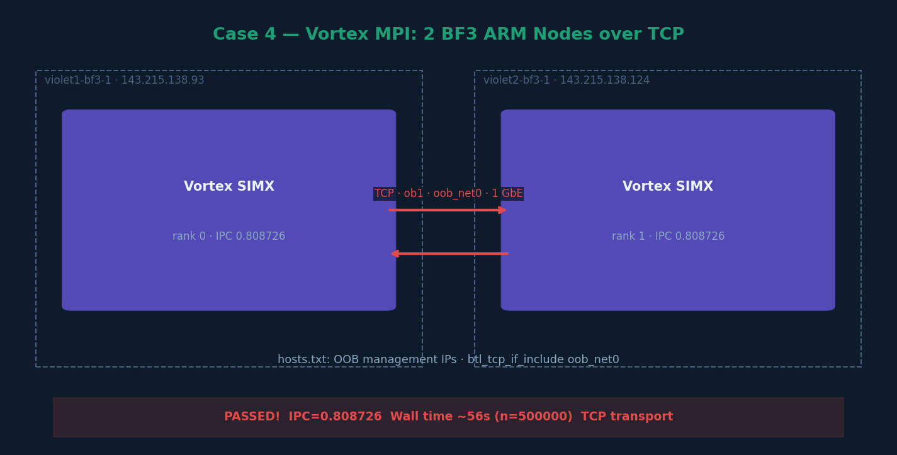

# Case 4 — Vortex MPI: 2 BF3 ARM Nodes over TCP



## What this case does

Runs Vortex SIMX MPI with 2 ranks distributed across two BF3 ARM nodes
(violet1-bf3-1 and violet2-bf3-1) using TCP as the MPI transport.
This proves cross-node execution works and establishes a TCP baseline
for comparison against RDMA in Case 5.

## Hardware

| Node | Role | IP (OOB) | Arch |
|---|---|---|---|
| violet1-bf3-1 | BF3 DPU ARM — rank 0 | 143.215.138.93 | aarch64 |
| violet2-bf3-1 | BF3 DPU ARM — rank 1 | 143.215.138.124 | aarch64 |

## Hostfile (hosts.txt)

```
143.215.138.124 slots=1
143.215.138.93  slots=1
```

Note: OOB management IPs used for MPI TCP transport (1GbE network).

## Steps

### Step 1 — Set environment (on violet1-bf3-1)
```bash
export VORTEX_DRIVER=simx
export LD_LIBRARY_PATH=/net/netscratch/rn84/may_code/vortex/build/runtime:\
/net/netscratch/rn84/may_code/vortex/third_party/ramulator:$LD_LIBRARY_PATH
```

### Step 2 — Verify connectivity
```bash
# On violet1-bf3-1:
mpirun -np 2 --hostfile hosts.txt hostname
# Expected:
# violet2-bf3-1
# violet1-bf3-1
```

### Step 3 — Ping-pong test (sanity check)
```bash
mpirun -np 2 \
    --hostfile hosts.txt \
    --mca pml ob1 \
    --mca btl tcp,self \
    --mca btl_tcp_if_include oob_net0 \
    --mca oob_tcp_if_include oob_net0 \
    ./new_ping_pong
```

Expected output:
```
Rank 0 (violet2-bf3-1) sending ping...........
Rank 1 (violet1-bf3-1) received ping
Rank 0 (violet2-bf3-1) received pong
Rank 1 (violet1-bf3-1) sending pong *****
```

### Step 4 — Run Vortex MPI vecadd over TCP
```bash
time mpirun -np 2 --hostfile hosts.txt \
    --mca pml ob1 --mca btl tcp,self \
    --mca btl_tcp_if_include oob_net0 \
    -x LD_LIBRARY_PATH -x VORTEX_DRIVER \
    --wdir /net/netscratch/rn84/may_code/vortex/build/tests/regression/mpi_vecadd \
    ./mpi_vecadd -n500000
```

## Example output

```
rank = 0, world_size = 2, host = violet2-bf3-1
rank = 1, world_size = 2, host = violet1-bf3-1
Rank: 0- Upload kernel binary
Rank: 1- Upload kernel binary
PERF: instrs=7503628, cycles=9278327, IPC=0.808726
PASSED!
PERF: instrs=7503628, cycles=9278327, IPC=0.808726

real    0m56.004s
user    0m48.516s
sys     0m1.250s
```

## Key observations

- IPC = 0.808726 — identical on both ranks, confirming symmetric compute
- TCP transport: `ob1` + `btl tcp` over `oob_net0` (1GbE management interface)
- Wall time: ~56s for n=500000 (compute dominated)
- MPI communication happens on the low-speed 1GbE OOB network
- The Vortex compute time dominates — network speed barely affects total time at this scale

## Comparison with RDMA (Case 5)

| Config | Transport | Wall time (n=500000) | IPC |
|---|---|---|---|
| Case 4 TCP | ob1/tcp · oob_net0 · 1GbE | 56.004s | 0.808726 |
| Case 5 RDMA | UCX dc_mlx5 · mlx5_2 · 100GbE | 55.617s | 0.808726 |

IPC is identical — proving transport does not affect Vortex computation.
