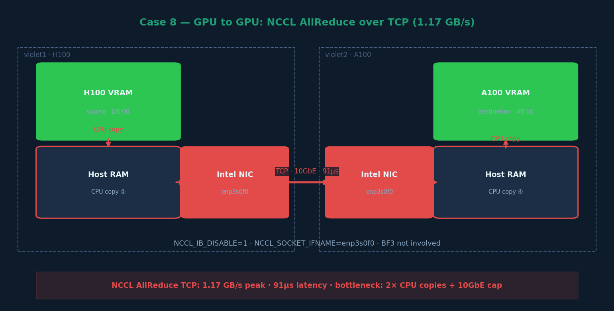

# Case 8 — GPU to GPU Communication over TCP (NCCL AllReduce)



## What this case does

Measures GPU-to-GPU AllReduce bandwidth using NCCL over TCP/IP sockets.
This is the baseline for distributed GPU training communication — the "slow path"
that motivates the use of RDMA and in-network compute.

## Hardware

| Node | GPU | IP (TCP) | NIC |
|---|---|---|---|
| violet1 | H100 PCIe (D8:00) | 143.215.138.110 | Intel enp3s0f0 · 10GbE |
| violet2 | A100 PCIe (A8:00) | 143.215.138.111 | Intel enp3s0f0 · 10GbE |

## Data path

```
H100 VRAM → CPU copy → Host RAM → Intel NIC (enp3s0f0) → 10GbE TCP
         → Intel NIC → Host RAM → CPU copy → A100 VRAM
```

Two CPU copies (one each side) + 10GbE bandwidth cap are the bottlenecks.

## Steps

### Step 1 — Load NCCL library
```bash
export LD_LIBRARY_PATH=/nethome/rn84/USERSCRATCH/x86_code/vortex/miscs/apptainer/nccl/build/lib:$LD_LIBRARY_PATH
```

### Step 2 — Run NCCL AllReduce over TCP
```bash
cd ~/USERSCRATCH/x86_code/vortex/miscs/apptainer/nccl-tests

mpirun -np 2 -H violet1:1,violet2:1 \
    -x LD_LIBRARY_PATH \
    -x NCCL_IB_DISABLE=1 \
    -x NCCL_SOCKET_IFNAME=enp3s0f0 \
    ./build/all_reduce_perf -b 8 -e 256M -f 2 -g 1
```

Key flags:
- `NCCL_IB_DISABLE=1` — disable RDMA, force TCP socket transport
- `NCCL_SOCKET_IFNAME=enp3s0f0` — use Intel 10GbE management NIC

## Example output (selected rows)

```
# Using devices
#  Rank  0 Group  0 Pid 751291 on    violet1 device  0 [0000:d8:00] NVIDIA H100 PCIe
#  Rank  1 Group  0 Pid 854307 on    violet2 device  0 [0000:a8:00] NVIDIA A100-PCIE-40GB

#       size         count      type   redop    root     time   algbw   busbw  #wrong
           8             2     float     sum      -1    91.44    0.00    0.00       0
        1024           256     float     sum      -1   142.62    0.01    0.01       0
      262144         65536     float     sum      -1   427.58    0.61    0.61       0
     1048576        262144     float     sum      -1  1021.15    1.03    1.03       0
    16777216       4194304     float     sum      -1  14518.0    1.16    1.16       0
    67108864      16777216     float     sum      -1  57368.2    1.17    1.17       0
   268435456      67108864     float     sum      -1   228738    1.17    1.17       0

# Avg bus bandwidth    : 0.488086
```

## Key results

| Metric | Value |
|---|---|
| Peak bandwidth (256MB) | 1.17 GB/s |
| Latency (8 bytes) | 91 µs |
| Transport | NCCL Socket (TCP) |
| NIC | Intel enp3s0f0 · 10GbE |
| Avg bus bandwidth | 0.49 GB/s |

## Troubleshooting notes

- Must run from outside SLURM allocation OR have 2-node SLURM job
- Use HPC-X mpirun if system mpirun fails multi-node launch
- `NCCL_SOCKET_IFNAME` is critical — without it NCCL may pick the wrong interface
- The GT SSH banner can interfere with MPI daemon launch: add `LogLevel ERROR` to `~/.ssh/config`

## Comparison with RDMA (Case 9)

| Transport | Peak BW | Latency | Speedup |
|---|---|---|---|
| TCP (Case 8) | 1.17 GB/s | 91 µs | baseline |
| RDMA (Case 9) | 9.49 GB/s | 30 µs | 8.1× |
