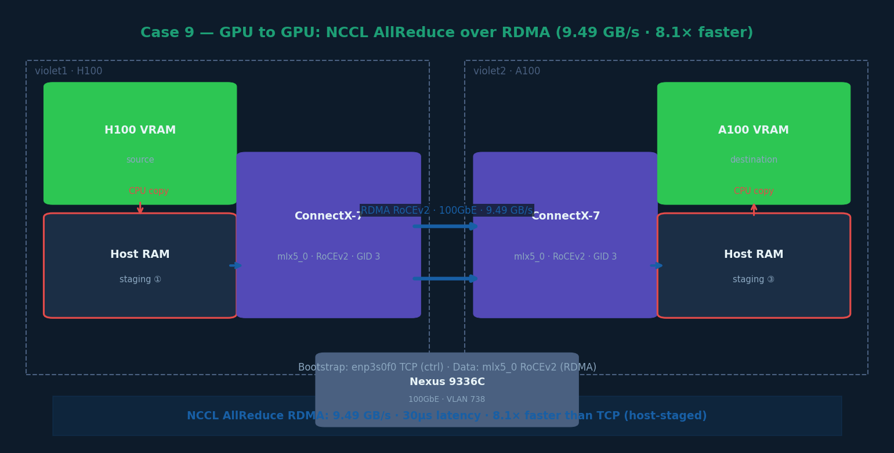

# Case 9 — GPU to GPU Communication over RDMA (NCCL AllReduce)



## What this case does

Measures GPU-to-GPU AllReduce bandwidth using NCCL over RoCEv2 RDMA via the
BF3 ConnectX-7 NIC (mlx5_0). This demonstrates the 8.1× speedup over TCP
achievable by switching to RDMA for distributed GPU communication.

Note: NCCL still uses host RAM as a staging buffer (host-staged RDMA).
True zero-copy would require GPUDirect (Case 10).

## Hardware

| Node | GPU | IP (RDMA) | Device | GID |
|---|---|---|---|---|
| violet1 | H100 PCIe | 10.10.10.49 | mlx5_0 | 3 |
| violet2 | A100 PCIe | 10.10.10.50 | mlx5_0 | 3 |

## Data path

```
H100 VRAM → CPU copy → Host RAM ─── mlx5_0 RoCEv2 ──→ Host RAM → CPU copy → A100 VRAM
                                   (ConnectX-7 RDMA)

Bootstrap control: enp3s0f0 TCP (143.215.138.x) — used for QP setup, not data
```

## Steps

### Step 1 — Load NCCL library
```bash
export LD_LIBRARY_PATH=/nethome/rn84/USERSCRATCH/x86_code/vortex/miscs/apptainer/nccl/build/lib:$LD_LIBRARY_PATH
```

### Step 2 — Run NCCL AllReduce over RDMA
```bash
cd ~/USERSCRATCH/x86_code/vortex/miscs/apptainer/nccl-tests

mpirun -np 2 -H violet1:1,violet2:1 \
    -x LD_LIBRARY_PATH \
    -x UCX_NET_DEVICES=mlx5_0:1 \
    -x UCX_IB_GID_INDEX=3 \
    -x NCCL_IB_HCA=mlx5_0 \
    -x NCCL_IB_GID_INDEX=3 \
    -x NCCL_SOCKET_IFNAME=enp3s0f0 \
    ./build/all_reduce_perf -b 8 -e 256M -f 2 -g 1
```

Key flags:
- `NCCL_IB_HCA=mlx5_0` — use ConnectX-7 for RDMA data
- `NCCL_IB_GID_INDEX=3` — RoCEv2 GID
- `NCCL_SOCKET_IFNAME=enp3s0f0` — bootstrap TCP interface (must match on both nodes)

### Step 3 — Verify RDMA transport in NCCL debug output
Add `-x NCCL_DEBUG=INFO` and look for:
```
NET/IB : Using [0]mlx5_0:1/RoCE [RO]; OOB enp3s0f0:143.215.138.110<0>
Using network IB
Channel 00/0 : 0[0] -> 1[0] [send] via NET/IB/0
```

## Example output (selected rows)

```
# Using devices
#  Rank  0 Group  0 Pid 751435 on    violet1 device  0 [0000:d8:00] NVIDIA H100 PCIe
#  Rank  1 Group  0 Pid 854663 on    violet2 device  0 [0000:a8:00] NVIDIA A100-PCIE-40GB

#       size         count      type   redop    root     time   algbw   busbw  #wrong
           8             2     float     sum      -1    30.37    0.00    0.00       0
      262144         65536     float     sum      -1   130.78    2.00    2.00       0
     1048576        262144     float     sum      -1   159.21    6.59    6.59       0
     4194304       1048576     float     sum      -1   464.75    9.02    9.02       0
    16777216       4194304     float     sum      -1  1793.42    9.35    9.35       0
    67108864      16777216     float     sum      -1  7116.46    9.43    9.43       0
   268435456      67108864     float     sum      -1  28400.9    9.45    9.45       0

# Avg bus bandwidth    : 3.49983
```

## Key results

| Metric | Value |
|---|---|
| Peak bandwidth (256MB) | 9.49 GB/s |
| Latency (8 bytes) | 30 µs |
| Transport | NCCL NET/IB · RoCEv2 · mlx5_0 |
| Avg bus bandwidth | 3.50 GB/s |

## Why 9.49 GB/s and not 92 Gb/s

Three reasons:
1. Host RAM staging: GPU VRAM → CPU copy → Host RAM → NIC (on both ends)
2. AllReduce algorithm: data transmitted twice (scatter + gather) with element-wise sum
3. PCIe bandwidth cap: ~32 GB/s per direction limits staging throughput

## Comparison table

| Transport | Peak BW | Latency | vs TCP |
|---|---|---|---|
| TCP (Case 8) | 1.17 GB/s | 91 µs | 1× |
| RDMA host-staged (Case 9) | 9.49 GB/s | 30 µs | 8.1× |
| GPUDirect RDMA (Case 10) | 92.58 Gb/s | — | 79× |
