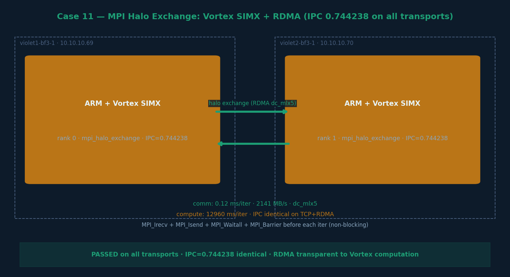

# Case K — MPI Halo Exchange Benchmark (Vortex SIMX + RDMA)



## What this case does

Runs a halo exchange benchmark where each MPI rank uses Vortex SIMX to compute
on a local chunk of data, then exchanges boundary (halo) regions with its neighbor
rank. Tests three configurations: single-node shared memory, cross-node TCP, and
cross-node RDMA. Demonstrates that Vortex IPC is identical regardless of transport.

Key finding: Vortex IPC = 0.744238 on all three transports — RDMA is transparent
to computation.

## Hardware

| Node | IP (OOB) | IP (RDMA) |
|---|---|---|
| violet1-bf3-1 | 143.215.138.93 | 10.10.10.69 |
| violet2-bf3-1 | 143.215.138.124 | 10.10.10.70 |

## Hostfiles

**hosts.txt** (OOB TCP):
```
143.215.138.124 slots=1
143.215.138.93  slots=1
```

**rdma_hosts.txt** (RDMA IPs):
```
10.10.10.70 slots=1
10.10.10.69 slots=1
```

## Steps

### Step 1 — Set environment
```bash
export VORTEX_DRIVER=simx
export LD_LIBRARY_PATH=/net/netscratch/rn84/may_code/vortex/build/runtime:\
/net/netscratch/rn84/may_code/vortex/third_party/ramulator:$LD_LIBRARY_PATH
```

### Step 2a — Run single-node (shared memory, both ranks same BF3)
```bash
mpirun --wdir /net/netscratch/rn84/may_code/vortex/build/tests/regression/mpi_halo_exchange \
    --allow-run-as-root --oversubscribe -np 2 \
    ./mpi_halo_exchange -n65536 -i50
```

### Step 2b — Run cross-node TCP
```bash
mpirun -np 2 --hostfile hosts.txt \
    --mca pml ucx \
    --mca oob_tcp_if_include oob_net0 \
    -x UCX_NET_DEVICES=mlx5_2:1 \
    -x UCX_IB_GID_INDEX=1 \
    -x UCX_TLS=dc_mlx5,sm,self \
    -x LD_LIBRARY_PATH -x VORTEX_DRIVER \
    --wdir /net/netscratch/rn84/may_code/vortex/build/tests/regression/mpi_halo_exchange \
    ./mpi_halo_exchange -n65536 -i50
```

### Step 2c — Run cross-node RDMA
```bash
mpirun -np 2 --hostfile rdma_hosts.txt \
    --mca pml ucx \
    --mca oob_tcp_if_include enp3s0f0s0 \
    -x UCX_NET_DEVICES=mlx5_2:1 \
    -x UCX_IB_GID_INDEX=1 \
    -x UCX_TLS=dc_mlx5,sm,self \
    -x LD_LIBRARY_PATH -x VORTEX_DRIVER \
    --wdir /net/netscratch/rn84/may_code/vortex/build/tests/regression/mpi_halo_exchange \
    ./mpi_halo_exchange -n65536 -i50
```

## Example output (RDMA config, n=65536, i=50)

```
=== MPI Halo Exchange Benchmark (non-blocking) ===
Ranks: 2  Chunk: 65536 floats (0.25 MB)  Iterations: 50
Total data per rank: 12.50 MB
Rank: 0- Upload kernel binary
Rank: 1- Upload kernel binary

--- Rank 0 (violet2-bf3-1) ---
  Comm:    6.1 ms total  0.12 ms/iter  2141.2 MB/s
  Compute: 647992.7 ms total  12959.85 ms/iter
  Total:   667748.6 ms
  Result:  PASSED! (0 errors)
PERF: instrs=1969708, cycles=2646516, IPC=0.744238

--- Rank 1 (violet1-bf3-1) ---
  Comm:    6.3 ms total  0.13 ms/iter  2095.3 MB/s
  Compute: 668291.3 ms total  13365.83 ms/iter
  Total:   668371.3 ms
  Result:  PASSED! (0 errors)
PERF: instrs=1969708, cycles=2646516, IPC=0.744238
```

## Results comparison

| Config | Comm/iter | BW | Vortex IPC | Result |
|---|---|---|---|---|
| Single-node shm | 0.10 ms | 2527 MB/s | 0.744238 | PASSED |
| Cross-node TCP | 0.13 ms | 1999 MB/s | 0.744238 | PASSED |
| Cross-node RDMA | 0.12 ms | 2141 MB/s | 0.744238 | PASSED |

**Key finding:** Vortex IPC = 0.744238 on all three transports.
Transport is completely transparent to Vortex computation.

## Implementation note

The benchmark uses non-blocking MPI (MPI_Irecv + MPI_Isend + MPI_Waitall) with
a MPI_Barrier before each iteration timer. This ensures symmetric, accurate
timing on both ranks. Earlier versions with MPI_Sendrecv showed asymmetric
results due to blocking synchronization.
