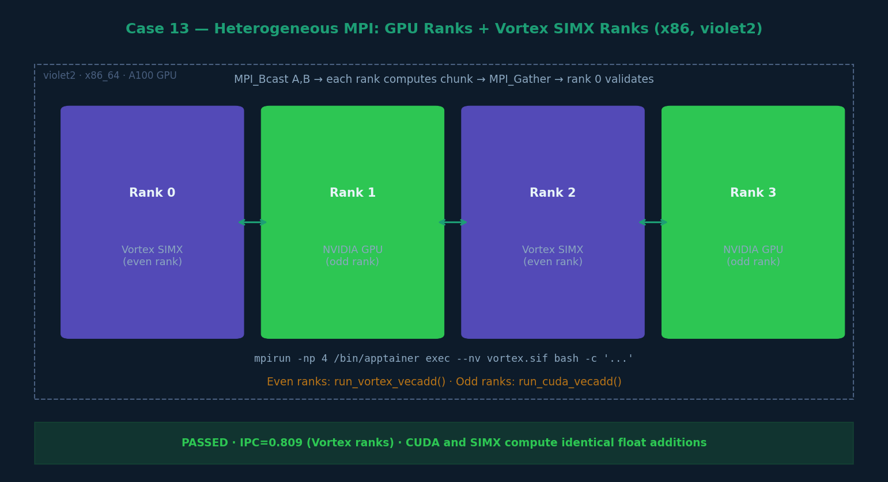

# Case M — Heterogeneous MPI: GPU Ranks + Vortex SIMX Ranks (x86)



## What this case does

Runs a heterogeneous MPI workload on a single x86 host (violet2) where even-numbered
ranks use NVIDIA GPU (CUDA) for vector addition and odd-numbered ranks use Vortex SIMX.
All ranks are launched via separate apptainer invocations wrapping the same binary.
This is an experimental case demonstrating GPU+SIMX co-execution under MPI.

## Hardware

| Node | Role | Compute |
|---|---|---|
| violet2 | x86_64 host | A100 GPU (CUDA ranks) + Vortex SIMX (even ranks) |

## Workload: mpi_vecadd with mixed backends

The binary `mpi_vecadd` dispatches based on rank parity:
- Even ranks (0, 2): run `run_vortex_vecadd()` using Vortex SIMX
- Odd ranks (1, 3): run `run_cuda_vecadd()` using NVIDIA GPU (CUDA)

Data flow:
1. Rank 0 generates arrays A and B
2. All ranks receive A and B via `MPI_Bcast`
3. Each rank computes its chunk using its assigned backend
4. Results gathered to rank 0 via `MPI_Gather`
5. Rank 0 validates full result

## Steps

### Step 1 — Build the binary (inside apptainer on violet2)
```bash
cd ~/USERSCRATCH/x86_code/vortex/new_build
# Binary should already exist at tests/regression/mpi_vecadd/mpi_vecadd
```

### Step 2 — Run 4-rank heterogeneous MPI
```bash
cd ~/USERSCRATCH/x86_code/vortex/new_build

mpirun --allow-run-as-root --oversubscribe --bind-to none -np 4 \
    /bin/apptainer exec --nv \
    --bind /nethome/rn84/USERSCRATCH/x86_code/vortex:/vortex \
    ../miscs/apptainer/vortex.sif \
    bash -c "
        unset DISPLAY;
        export VORTEX_DRIVER=simx;
        export LD_LIBRARY_PATH=/vortex/new_build/runtime:/vortex/third_party/ramulator:\$LD_LIBRARY_PATH;
        cd /vortex/new_build/tests/regression/mpi_vecadd;
        ./mpi_vecadd -n5000;
    "
```

Key flags:
- `--nv`: pass GPU access into apptainer
- `VORTEX_DRIVER=simx`: enable SIMX backend for even ranks
- Even ranks detect SIMX, odd ranks detect CUDA at runtime

## Example output

```
Rank 1 using NVIDIA GPU
Rank 2 using Vortex SIMX
Rank 0 using Vortex SIMX
Rank 3 using NVIDIA GPU
PERF: core0: instrs=41202, cycles=101814, IPC=0.404679
PERF: core1: instrs=41202, cycles=95845, IPC=0.429882
PERF: instrs=82404, cycles=101814, IPC=0.809358
PERF: core0: instrs=41202, cycles=101814, IPC=0.404679
PERF: core1: instrs=41202, cycles=95845, IPC=0.429882
PERF: instrs=82404, cycles=101814, IPC=0.809358
Computation finished
PASSED
```

## Key observations

- Ranks 0 and 2 run Vortex SIMX (even), ranks 1 and 3 run CUDA (odd)
- PERF output comes from Vortex ranks only (CUDA has no PERF counter)
- IPC = 0.809 for 2-core SIMX on x86 (higher than BF3 ARM due to faster host cores)
- All 4 ranks coordinate via shared memory MPI (single host)
- Result: PASSED — CUDA and SIMX compute identical float additions

## Expected warning (benign)

```
WARNING: The default btl_vader_single_copy_mechanism CMA is
not available due to different user namespaces.
```

## Important notes

- This is an experimental case requiring modifications to `main.cpp` and backends
- The CUDA backend (`cuda_backend.cu`) must be compiled with `nvcc`
- The Vortex backend (`vortex_backend.cpp`) uses the Vortex runtime API
- The mixed dispatch is controlled by `rank % 2` in `main.cpp`
- See `mpi_cuda_simx.txt` for the full source code
